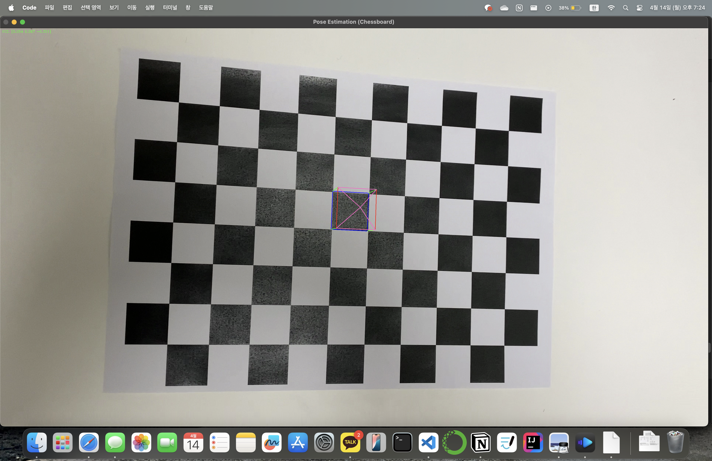
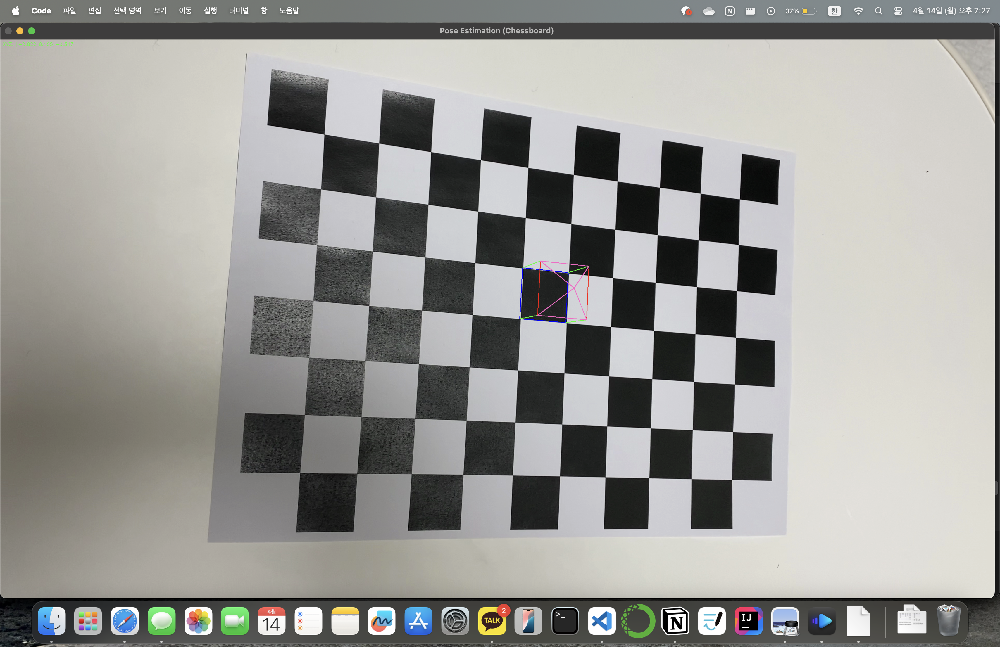

# Camera_Pose_Estimation_and_AR
Simple Camera pose estimation and AR.
카메라를 캘리브레이션한 결과를 이용해서 영상에 간단한 AR물체를 표시해봤습니다.

## Camera Calibration Results 
- 캘리브레이션한 결과
* The number of selected images = 6
* RMS error = 1.1425782409114145
* Camera matrix (K) = 
[[2.83314803e+03 0.00000000e+00 1.91286089e+03]
 [0.00000000e+00 2.93743676e+03 1.00917492e+03]
 [0.00000000e+00 0.00000000e+00 1.00000000e+00]]
* Distortion coefficient (k1, k2, p1, p2, k3, ...) = [ 0.15505307 -0.26711852 -0.00479147  0.00182268 -0.67999317]

---------------------------------
### house1

### house2
 